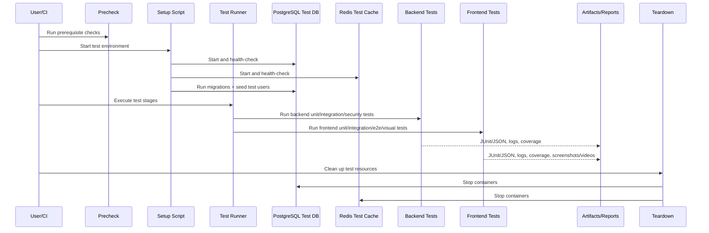

# Test System Architecture

This diagram describes how the application's testing system is structured and how tests are executed end-to-end.

## 1) Testing Architecture (Logical View)

```mermaid
graph TD
    Dev[Developer / CI Trigger]

    subgraph Orchestration[Testing Orchestration]
        Precheck[check-prerequisites.sh]
        Setup[setup-test-env.sh]
        Runner[run-tests.sh]
        Teardown[teardown-test-env.sh]
        Summary[generate_summary.py]
    end

    subgraph Config[Configuration]
        ShConfig[testing/config/test-config.sh]
        YamlConfig[testing/config/test-config.yml]
        PytestCfg[backend/pytest.ini]
        JestCfg[frontend/jest.config.js]
    end

    subgraph Runtime[Test Runtime Services]
        TestDB[(PostgreSQL Test DB :5433)]
        TestRedis[(Redis Test Cache :6380)]
        BackendApp[Backend FastAPI Test Mode]
        FrontendApp[Frontend Next.js Test Mode]
    end

    subgraph TestSuites[Test Suites]
        BEUnit[backend-tests/unit]
        BEInt[backend-tests/integration]
        BESec[backend-tests/security]
        BEE2E[backend-tests/e2e]
        FEUnit[frontend-tests/unit]
        FEInt[frontend-tests/integration]
        FEE2E[frontend-tests/e2e]
        Perf[performance tests]
        Visual[visual regression tests]
    end

    subgraph Artifacts[Reports & Artifacts]
        Coverage[reports/coverage]
        Results[reports/test-results]
        Logs[reports/logs]
        Screens[reports/screenshots]
        Videos[reports/videos]
    end

    Dev --> Precheck --> Setup --> Runner --> Summary --> Teardown

    ShConfig --> Runner
    YamlConfig --> Runner
    PytestCfg --> BEUnit
    JestCfg --> FEUnit

    Setup --> TestDB
    Setup --> TestRedis
    Runner --> BackendApp
    Runner --> FrontendApp

    Runner --> BEUnit
    Runner --> BEInt
    Runner --> BESec
    Runner --> BEE2E
    Runner --> FEUnit
    Runner --> FEInt
    Runner --> FEE2E
    Runner --> Perf
    Runner --> Visual

    BEUnit --> Results
    BEInt --> Results
    BESec --> Results
    BEE2E --> Results
    FEUnit --> Results
    FEInt --> Results
    FEE2E --> Results
    Perf --> Results

    BEUnit --> Coverage
    FEUnit --> Coverage

    Runner --> Logs
    FEE2E --> Screens
    FEE2E --> Videos
```

## 2) Execution Flow (Sequence View)

## Notes

- Test environment is isolated from development services using dedicated ports and test-mode configuration.
- The runner supports stage-based execution and fail-fast/non-fail-fast strategies.
- Reports are centralized under `testing/reports/` for CI consumption and local debugging.
