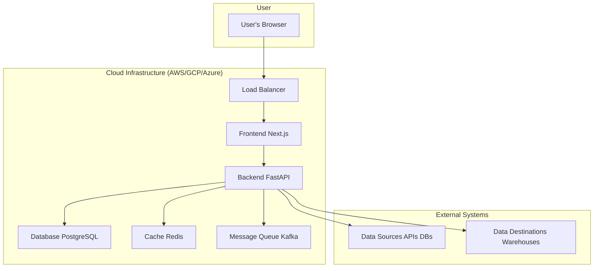
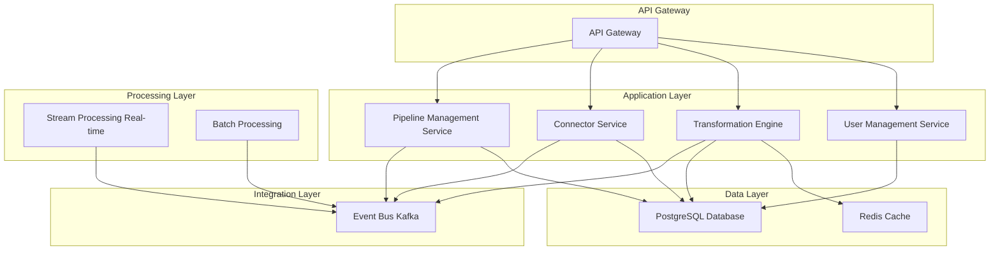
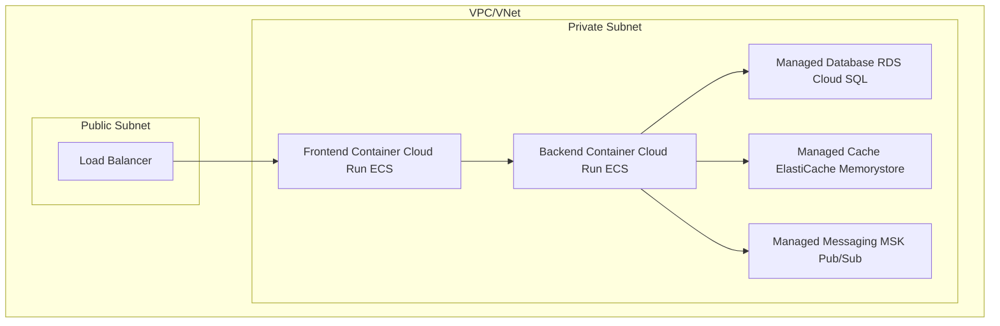
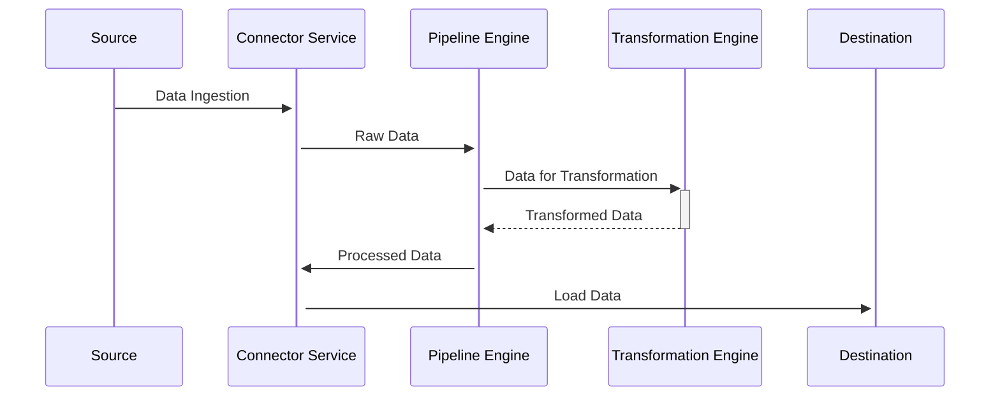

# Architecture Diagrams

This document provides a visual overview of the Data Aggregator Platform's architecture.

## 1. High-Level System Architecture

This diagram illustrates the overall structure of the platform, showing the main components and their interactions.

## 2. Backend Microservices Architecture

This diagram shows the internal components of the backend, as described in the architecture document.

## 3. Logical Cloud Deployment Architecture

This diagram provides a logical view of how the services are deployed in a cloud environment like AWS, GCP, or Azure.

## 4. Data Pipeline Flow

This sequence diagram illustrates the flow of data through a typical pipeline.

